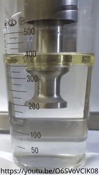

# Lubemaking

I am not a professional lube formulator. This guide is based on my personal research and experiments. If you find a mistake, have a comment, or want to contact me for some reason, send me an [email](mailto:kuuube@kuuu.be).

## Should you make your own lube?

Maybe. Here's a few reasons you should and shouldn't make your own lube:

### Cost

The initial cost to start making your own lube can be high, especially when making a more complex lube than a basic water based one. If you don't use a lot of lube or don't like the idea of buying a potentially lifetime supply of ingredients this may not be for you.

On the other hand, it is often possible to make 5-10+ gallons (≈20-40 liters) of lube for the same price as a 4-8oz (≈120-250ml) bottle of storebought lube. Water based (and hybrid water based) lubes are incredibly inexpensive to produce.

When buying water based lube, a large part of the price is the logistics required for shipping around water and some padding on the company's revenue. Lube does not have even close to the economy of scale that bottled water has even though the cost in ingredients required to make both are almost identical. You can turn an entire [40 pack of purified bottled water](./assets/bottled_purified_water_40_pack.jpg) into high quality water based lube for <$10 in ingredients. This quantity of lube bought from a store could cost thousands of dollars.

Beyond water based or hybrid water based lubes, it is usually still cheaper to make your own but by a much smaller margin.

### Convenience

It is convenient to place an order for lube online or drop by a store and pick some up with no hassle. Or is it? What if the store is out of stock? What if the shipping times are longer than you'd like?

For the hassle of mixing the lube, you gain the ability to make any amount at nearly a moment's notice. A water based lube can be mixed and ready to use within an hour, start to finish.

### Risk

It is possible to make mistakes and create a lube that is unsafe. Testing on less sensitive skin (such as the forearm) before use on genitals or other sensitive areas helps catch most issues early but not all.

You could supply an ingredient that is hazardous or use it in quantities that are hazardous and not realize. This typically can be avoided by ensuring all ingredients meet cosmetics standards and are considered safe for use in contact with mucous membranes in the quantities you are using.

But making your own lube could also reduce risk. Sex related industries have limited regulation and although lube is more regulated than some sectors, it has plenty of problems. Many lube manufacturers do not care about the safety of their lube to the extent they should. Having full control over the recipe, supplying of the ingredients, and mixing of the final product gives you the power to ensure your lube is up to the exact standards that you want it to be.

Even beyond manufacturers making unsafe formulations, production issues from reputable companies can create [unsafe lube batches](./assets/ppr_sliquid_2026-08-26_14-02-35.png).

## Permanence

If you have the recipe for the lube you like, no company decision can decide to get rid of that product. You can have troubles with suppliers of raw ingredients but it is much easier to continue production (or reformulate in the worst case) when you've developed the lube yourself.

You also are likely to have a significant amount of raw materials on hand to continue making your lube for awhile even if it becomes impossible to obtain an ingredient. This shields you from temporary supplychain problems more strongly than most large volume productions are able to shield themselves.

## Types of lube you should not make at home

Even if you think you're up to the task of making lube, there are some types of lube that should never be made at home or should have further thought put in before starting.

### Sterile bacteriostatic surgical or medical lubricants

These are used for surgical and medical procedures where the lubricant being sterile is critical. Some example uses include: insertion of urethral catheters and medical examination of the vagina or rectum. Among others, a few popular lubes in this category are: Surgilube, Dynalube, McKesson Lubricating Jelly, Aquagel, Bonnaqua Jelly, K-Y Jelly (note that K-Y makes many similarly named lubricants which are not sterile), HR Lubricating Jelly, and Medline Lubricating Jelly.

In masturbation or sexual acts, these commonly get used for sounding or uretheral insertions due to the increased risk of infection in those areas compared to the vagina or rectum.

While copying these recipes is certainly doable, it is not as easy to ensure a sterile environment and end product. Medical lubricants also tend to be much cheaper than standard sex lubricants due to the medical industry needing large amounts of them. The opportunity to save money is lower and the risk is far higher.

I must also mention that you should not use these lubricants if you do not need to. Just because these are certified for medical use and regulated to a higher degree than most sex lubes does not mean they are better for all uses. Many formulations of medical lube can be harsher on the body. The goal of these lubes is to reduce the risk of infection from a medical procedure.

### Eye or ear lubricants

Similar to the surgical or medical lubricants, these need to be sterile. You **do not** want to use eye or ear lubricants that could be contaminated with bacteria.

However, these are even more specialized than most medical lubricants, many surgical or medical lubricants specifically say they are not for use in eyes or ears. This category includes lubricating eyedrops for dry eyes, artificial tears, earmolding lubricants, and hearing aid lubricants.

I highly recommend against attempting to make any lube that interacts with the eyes or ears.

### Silicone lubes

If you've looked at the ingredients list of a silicone lube you might see some contain as few as 1-3 ingredients. This seems like the easiest thing to make.

Unlike water based lubes which are an easy win on price since water is cheap, silicone oils are expensive. Saving money making your own might be possible but ensure this is the case by doing the math on all the costs before starting.

Being aware of the dangers dealing with volatile silicone oils is also important. Volatiles are typically included in low quantities in silicone lubes to enhance performance. Not all silicone oils are volatile but ones that are may evaporate at room temperature and combust at a relatively low temperature. Read the safety data sheets, have the proper PPE, and be prepared for anything that could go wrong.

## Making water based lubes

Water based lubes are by far the easiest and cheapest to make.

### Water

Water can make a big difference in the end result of a water based lube, not all water is the same. The purest possible water is not necessary. I recommend using purified bottled water or equivalent.

Tap water:
- If your tap water isn't drinkable, don't even think about using it for lube.
- Some ingredients may unfavorably interact with or degrade when added to tap water. In particular, chlorine often causes issues.
- pH may vary, keep this in mind if you need to do pH balancing.
- May create lube that has a shorter shelf life.

Filtered/purified tap water:
- Purity and remaining chemicals or minerals depend on your filtration or purification system.
- pH may vary, similar to plain tap water.

Bottled spring/mountain/iceberg/whatever water:
- The same as tap water minus water treatment chemicals such as chlorine.
- Depending on the collection location, the pH and mineral content can differ.

Purified bottled drinking water:
- Depending on the purification methods, this can produce extremely pure water (reverse osmosis is typical). Most bottled waters add minerals back into their water after purification.
- Should have a consistent pH and mineral content. Unlikely to include chemicals that will degrade lube ingredients.

Distilled water:
- Pure water. About the same as reverse osmosis purification but unlike drinking water, it won't have added minerals.

### Thickeners

There are many different thickeners to choose from. These are my notes on thickeners, much of this is from tests I have personally conducted. There are many other viable thickeners not listed here. With many of these polymers, differences in molecular weight will vastly affect the lube's performance.

Carboxymethylcellulose (CMC):
- Hydrates fast
- Works well in small quantities
- Shear thinning
- Clear solution when fully settled
- Stable in solution

Hydroxyethylcellulose (HEC):
- Hydrates fast or slow (if R-grade)
- Works well in small quantities
- Shear thinning
- Clear solution when fully settled
- Stable in solution

Guar Gum (Cyamopsis):
- Hydrates fast
- Works well in small quantities
- Shear thinning
- Translucent white solution when fully settled
- Not stable in solution, split after a few days possibly due to inadequate preservatives

Polyethelene Oxide (PEO):
- Hydrates fast
- Works well in small quantities
- Shear thinning
- Clear solution when fully settled
- Super stringy when high molecular weight (eg. X-Lube powder)
- Low molecular weight variants are called Polyethelene Glycol or PEG
- May degrade and not function properly in slightly acidic solutions. Keep the pH very close to neutral, around 6.5-7.
- Stable in solution

### Preservatives

Handling undiluted preservatives tends to be the most dangerous part of making a lube, even if the preservatives are mild in solution. Wear proper PPE. At minimum, have eye protection and gloves. Read the material safety data sheets and be prepared for anything that could go wrong.

I am not an expert on preservatives in cosmetics or lubes. The following is correct to the best of my ability. Please double-check and do your own research before putting potentially harmful substances in your body. Remember that preservatives are meant to kill living organisms, preservatives used in the wrong quantities or mixes can be toxic to the human body. And be careful if you go without a preservative, they exist for our safety, using a lube with bacterial growth in it is far more harmful than correctly formulated preservatives.

No preservative:
- Some lubes last just a few days before spoiling depending. Typically, a lube can last a few weeks to a few months but it depends on the formulation and if it gets contaminated.
- There is nothing to fight off bacteria from contamination.

    For example, if the lube is used for anal and the bottle touches against a toy, anus, or contaminated hand, it may now be unsafe to use for vaginal or oral insertions.
- Depending on the formulation, you may not even be able to see bacteria, mold, or fungus growing.
- Unacceptable for water based lubes intended for commercial sale. While the sales or marketing department might be giddy at the idea of slapping "preservative free" on the bottle, it is incredibly irresponsible and may cause legal trouble to sell a water based sex lube without any preservative.

Potassium Sorbate, Sodium Benzoate, Citric Acid:
- Effective pH range: <5, most active pH: ≈3.
- Do not use potassium sorbate or sodium benzoate in a neutral pH solution and expect it to be effective.
- Citric acid is not entirely necessary but is a popular and safe way of dropping the pH for vaginal use and the use of these preservatives.

Phenoxyethanol, Ethylhexylglycerin:
- Effective pH range: 3-10
- Phenoxyethanol usage in cosmetics (including those with mucous membrane contact) in the EU is capped at 1%. More than 1% or even close to 1% should never be required for a lube.
- Phenoxyethanol may be paired with Ethylhexylglycerin to be an effective broad spectrum preservative (Phenoxyethanol alone is mostly for gram-negative bacteria).

    A 90:10 ratio of Phenoxyethanol to Ethylhexylglycerin is available premixed by many vendors and sold as PE 9010.

Preservative regulation lists:
- [EU ECHA: Cosmetic Products Regulation, Annex V - Allowed Preservatives](https://echa.europa.eu/cosmetics-preservatives)

Misc:
- [Whole Foods: Cosmetics Banned Ingredients List](https://www.wholefoodsmarket.com/quality-standards/beauty-body-care-standards) and [Whole Foods: 2017 Supplier Quality Standards List](https://www.makingskincare.com/wp-content/uploads/2018/08/wholefoods-natural-Body-Premium-Standard.pdf)

    While Whole Foods obviously is not a regulatory body, it may be worth checking against this banned ingredients list before using an ingredient. They tend to ban things for a good reason.

    Whole Foods doesnt typically make their full acceptable/unacceptable ingredient lists public. The list from 2017 is a bit old but may be useful to reference.
- [Making Skincare: Preservative Reviews](https://makingskincare.com/preservatives/)

### Humectants

These are added to keep water based lubes wet. But are controversial due to the common resulting [unsafe high osmolality](https://phallophilereviews.com/ph-balanced-lubricant-guide-safety/#why-some-popular-lubricants-are-unsafe). This means they can suck water out of cells, leaving the tissue dried out. Some people also report [stinging and irritation](https://www.ahyes.org/blogs/ingredients/why-does-my-lube-sting-the-osmolality-problem-nobody-explains). There are safe thresholds for osmolality but unfortunately it isn't simple to test a lube's osmolality, [an osmometer is required](https://www.fishersci.com/us/en/browse/90207019/Osmometers) which can be very expensive.

The most common humectants for lube are Propanediol, Glycerin, and Propylene Glycol (not to be confused with Polyethelene Glycol).

I will not be providing guidance on how to use humectants. Although most lubes use these, I recommend against it. If you do choose to use a humectant, do it in the minimum quantity required to achieve the result you desire.

### Colorants and color additives

These are completely optional. If you want your lube to look like cum, blood, monster slime, or some other fluid, you may need a colorant. For cum, simply making a hybrid water/silicone lube rather than adding a colorant may give the desired white color due to the differing refractive indexes.

Be VERY careful when selecting colorants, there are plenty of pigments that are completely toxic, can only be used externally, can only be used on certain areas of the body, or have conflicting approval between FDA and EU regulations. Do not assume natural colorants are safer than synthetics. To ensure your lube is safe, I recommend checking both the FDA and EU regulations regarding color additives or colorants that are approved for cosmetic use around the eyes, mouth (lipstick), and mucous membranes.

Colorant regulation lists:
- [FDA: Color Additives Permitted for Use in Cosmetics](https://www.fda.gov/cosmetics/cosmetic-ingredient-names/color-additives-permitted-use-cosmetics)
- [FDA: Regulatory Status of Color Additives in Cosmetics](https://hfpappexternal.fda.gov/scripts/fdcc/?set=ColorAdditives&sort=Sort_Unique_ID&order=ASC&startrow=1&type=column&search=Use-current%C2%A4VARCHAR%C2%A4cosmetics)
- [EU ECHA: Cosmetic Products Regulation, Annex IV - Allowed Colorants](https://echa.europa.eu/cosmetics-colorant)

Additional resources:
- [FDA: Color Additives and Cosmetics: Fact Sheet](https://www.fda.gov/industry/color-additives/color-additives-and-cosmetics-fact-sheet)
- [FDA: How Safe are Color Additives?](https://www.fda.gov/consumers/consumer-updates/how-safe-are-color-additives)

### pH balancing

The most common use case for pH balancing is creating a lube that matches the vaginal pH range of 3.8-4.5 (as opposed to a pH of 6-8 in the rectum). Anal or external lubes typically do not need pH adjustment. If you need a lube for both vaginal and anal use, pH balance it for vaginal. But beware that people with sensitive rectums may feel an uncomfortable stinging sensation when using a lower pH lube anally.

You will need a pH meter or pH test strips to test the pH at various points during the process. I do not recommend buying a super cheap digital pH meter, buy test strips if you need a cheap option.

Decreasing the pH is usually done by adding citric acid. Citric acid can VERY quickly drop the pH of a solution, be careful to measure the pH and ensure it matches the expected level. As little as 0.1-0.5g for 1 liter may be enough but it can depend on the water being used. Add the acid in multiple parts and measure the pH as you go.

Keep in mind that other ingredients may also change the pH. Citric acid should be doing the vast majority of the work but the pH should be checked after adding other ingredients to ensure it's within an acceptable range. Cellulose thickeners shouldn't change the pH, you should balance your solution before adding them as it will be much harder to mix thoroughly after adding a thickener.

### Mixing

#### Bad things we don't want
- Bubbles. In thicker lubes this is much more of an issue as they can take days to fully settle out and may create an undesirable texture until settled.
- Agglomerates. These are clusters of thickened gel that shield the center powder from hydrating. Typically agglomerates will eventually hydrate but it can take awhile. If you get agglomerates, check back in a few hours and they may disappear.
- Chopping up molecules. When using high molecular weight polymers such as Polyethelene Oxide, it is important to not use high shear mixing since it can chop up and destroy the long molecular chains.
- Overfilled containers. Almost all mixing methods degrade significantly when you use a container that is highly filled (75-100% full).

#### Types of mixing

For your first batch of lube, I recommend mixing it in a bottle. Fill the bottle roughly 50% full to ensure plenty of room for mixing.

Shaking in a bottle:
- Low shear mixing.
- Requires "babysitting" when using a slow hydrating powder.
- Makes an enormous amount of bubbles.
- Requires significant speed and physical exersion to mix fast hydrating powders with zero agglomerates especially at high thickener percents.
- Zero cost as long as you're able bodied or have someone who is that can help.

Vortex mixers:
- Low shear mixing.
- Not ideal for fast hydrating powders due to gentle mixing even at high speeds.
- Minimal bubble formation but can create foam if used suboptimally.
- Not intended for long mixing times. Good for quick bursts.
- Decently cheap.

Magnetic stirrers:
- Low shear mixing.
- Not ideal for fast hydrating powders due to gentle mixing even at high speeds.
- May struggle to mix high thickness gels.
- Can be integrated with a hotplate for easily mixing ingredients that need to be heated.
- Minimal bubble formation.
- Decently cheap.

Kitchen blender or food processor:
- High shear mixing.
- May struggle to mix high thickness gels.
- Medium price but many kitchens already have one.

Immersion blender:
- High shear mixing.
- Typical kitchen immersion blenders may struggle to mix high thickness gels.
- Decently cheap.

## Making hybrid water based lubes

There is a misconception that hybrid lubes require specialized equipment such as an ultrasonic homogenizer to make. But in actuality, you only need the correct ingredients.

While ultrasonic homogenizers are awesome and can create emulsions with extremely small droplet sizes or make unstable dispersions last a long time, it isn't necessary to make a high performance hybrid lube. An ultrasonic homogenizer mixing oil and water:

I'm certainly not an expert in making emulsions or dispersions but I have successfully made stable hybrid lubes without any special equipment.

Technically, emulsions and dispersions are never stable. Theyre "metastable" which means that given enough time they should eventually split, even if it takes a million years. There is also a difference between an emulsion and a dispersion. A dispersion is stable only due to the viscosity of the solution it is in whereas an emulsion will be stable even if the viscosity changes due to dilution. For the purposes of a lube, a true emulsion is not necessary since thickeners will be added and it will not be diluted.

### Surfactants

I will not be commenting on the safety of any of these surfactants or exactly how each of them interact due to my limited experience on the subject.

By far the most popular surfactants for making hybrid lubes are polysorbates. There are three major polysorbates: 20, 60, and 80. There are others such as polysorbate 21, 40, 61, 65, 81, and 85 but they are not widely used so I will be ignoring them. Polysorbate 20 and 60 are found in many hybrid lubes whereas the others are not. The lower the number the more hydrophilic (likes water), the higher the number the more lipophilic (likes oils or fats).
- Polysorbate 20 is best for light oils or small amounts of oil in large amounts of water. It is a thin liquid and can be mixed at room temperature.
- Polysorbate 60 makes a thicker and higher stability emulsion than polysorbate 20. Less prone to oxidation compared to polysorbate 80. It is a semi-solid wax at room temperature and must be heated into a emulsion.
- Polysorbate 80 is best for heavy oil emulsions and large amounts. (The silicone oil used in hybrid lubes is typically not heavy and the 1-2% included is not much.)

Other surfactants I've seen in hybrid lubes ordered from most to least common: Glyceryl Stearate, Sorbitan Monostearate, Trideceth-6, PEG-100 Stearate, and Hydrogenated Lecithin.

### Oils

Typically, the term "hybrid lube" means a water/silicone oil mix. But it doesn't have to be silicone, other oils could be mixed as well.

### Water soluble oils

Many hybrid lubes use PEG or PPG dimethicone alongside regular dimethicone. This is silicone oil that has been bonded to PEG (Polyethelene Glycol) to form an amphilic molecule (likes both oil and water) so it can be soluble in water.

## Example recipes

### Two-ish ingredient lube

At its most basic form, water based lube can be made solely from water and a thickener. The lube can be mixed in a single bottle.

You will need to experiment to find the exact thickener percent that you prefer. Different brands, grades, and types of thickeners will all perform slightly differently. The 1-3% range is given as a starting guide but if you want a thin near-water viscosity or a thick gel viscosity, going outside this range may be necessary. Viscosity tends to scale exponentially with the amount of thickener added.

| Ingredients                                                                           |   %    |
|---------------------------------------------------------------------------------------|--------|
| Water                                                                                 | 97-99% |
| Thickener of your choice. See: [Picking your thickener](#picking-your-thickener)      |  1-3%  |
| Citric acid (if you intend to use this lube vaginally)                                |   ?%   |

Instructions:
1. Get a bottle with a cap that can hold twice the quantity of lube you plan on making.
2. Weigh out the water into the bottle. Weigh out the thickener onto a weigh boat or small piece of paper.

    If you plan on making this a vaginal lube, [pH balance](#ph-balancing) your water now using the citric acid, before the thickener is added.
3. Swiftly pour the thickener into the water, cap the bottle, and shake it vigorously for 30 seconds.

    This step is very time sensitive for fast hydrating powders, if you make a mistake or spill some powder outside the bottle, ignore it and continue. Clean up and re-evaluate your process after shaking.

    If the solution has not thickened at all during this time and you can still see powder in the water, you likely have a slow hydrating powder. Skip the next step and agitate gently until it thickens. Some slow hydrating powders can take 30-60 minutes to hydrate.
4. Wait 10 minutes and shake for 30 seconds again.
5. Let the lube sit for 1-2 hours. Depending on the thickness of the lube, it may take hours or days for the bubbles to settle out fully but the lube is ready to use even if there are still bubbles present.

### Barebones hybrid lube

This is identical to [Two-ish ingredient lube](#two-ish-ingredient-lube) except it adds dimethicone and polysorbate 20. I have tested this recipe with 6 cSt (low viscosity) dimethicone.

| Ingredients                                                                           |     %      |
|---------------------------------------------------------------------------------------|------------|
| Water                                                                                 | 94.5-92.5% |
| Polysorbate 20                                                                        |    2.5%    |
| Dimethicone                                                                           |     2%     |
| Thickener of your choice. See: [Picking your thickener](#picking-your-thickener)      |    1-3%    |
| Citric acid (if you intend to use this lube vaginally)                                |     ?%     |

Instructions:
1. Get a bottle with a cap that can hold twice the quantity of lube you plan on making and a small vial with a cap that will hold about double the polysorbate and dimethicone.
2. Weigh out the polysorbate and dimethicone into the small vial. Weigh out the water into the bottle. Weigh out the thickener onto a weigh boat or small piece of paper.

    If you plan on making this a vaginal lube, [pH balance](#ph-balancing) your water now using the citric acid, before the thickener is added.
3. Shake up the vial of polysorbate and dimethicone. It should form a cloudy mix which will separate in about 30 seconds.
4. Before the polysorbate and dimethicone have separated, add them to the water, shake up the water briefly, and add the thickener. Follow the same final steps as [Two-ish ingredient lube](#two-ish-ingredient-lube) for mixing the thickener.

After bubbles have settled out, the resulting solution should be a translucent white color.

## Deformulation

I defer to Perry Romanowski's ["How To Knock-Off a Cosmetic Formula"](http://www.scientificspectator.com/documents/personal%20care%20spectator/Duplicating%20a%20Formulation.pdf).

You don't need to recreate a perfect copy of the lube you're trying to deformulate. Figure out how to make a lube that performs in the ways you care about and ignore the parts you don't need or want to change.
